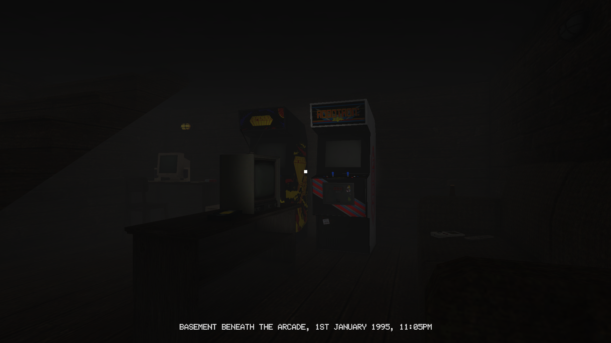
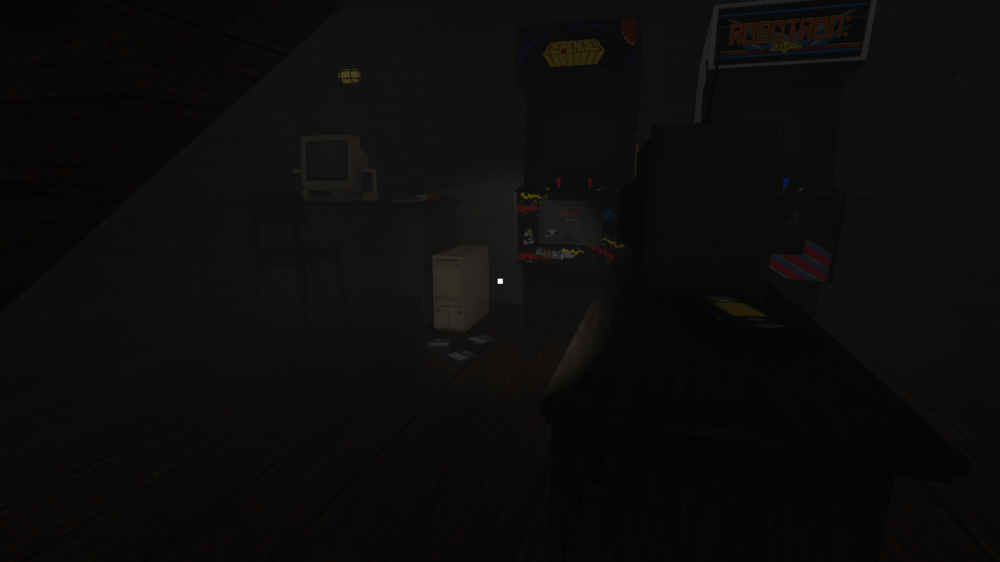
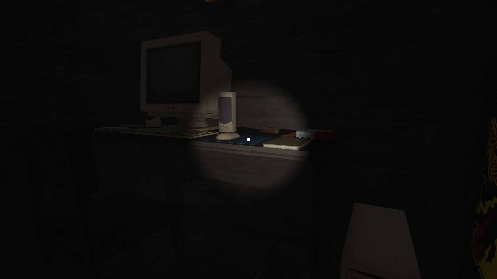
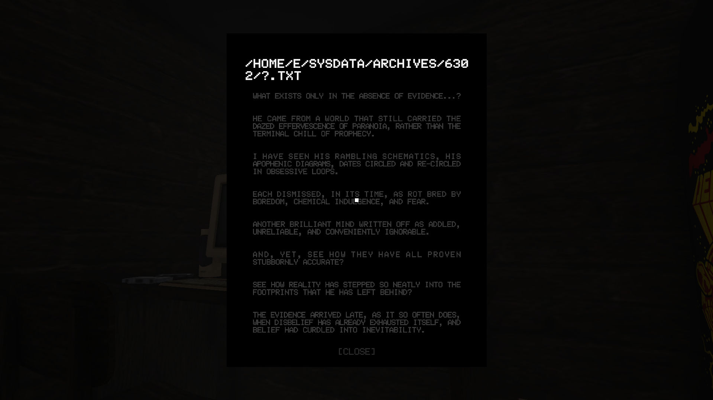
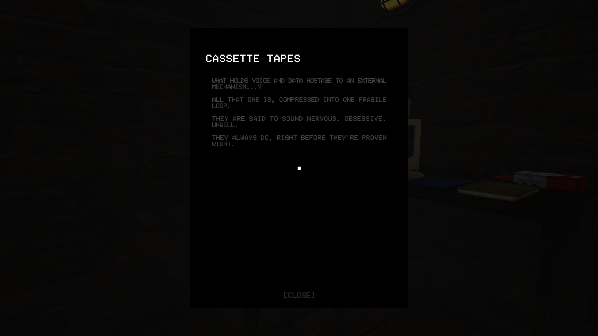
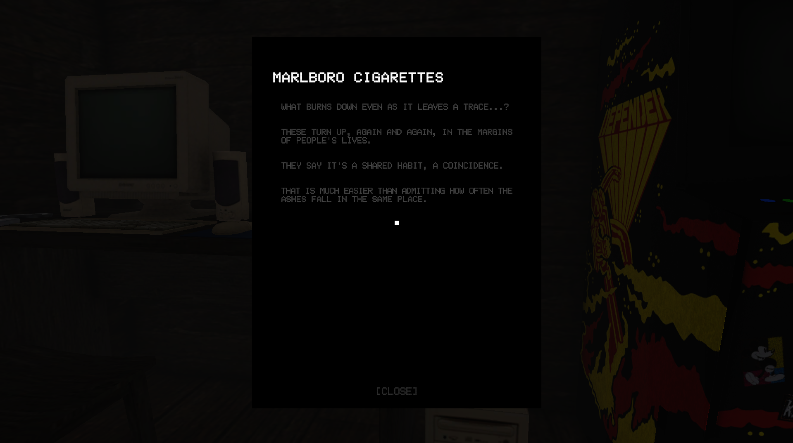
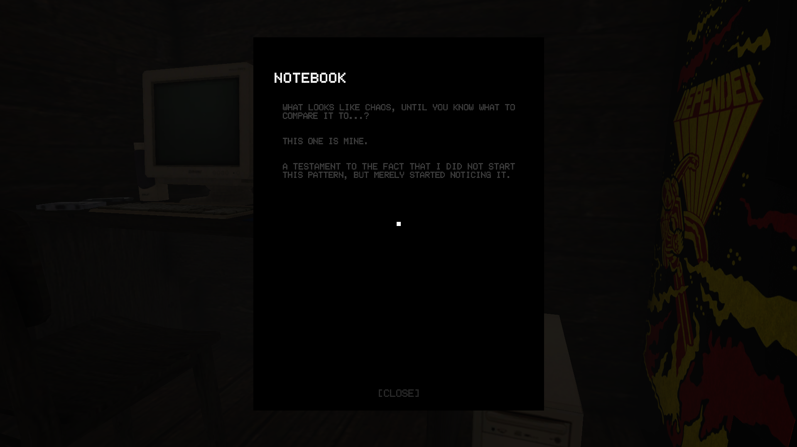
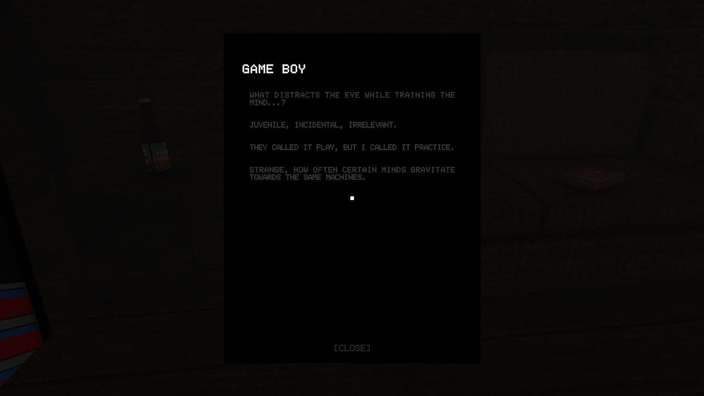
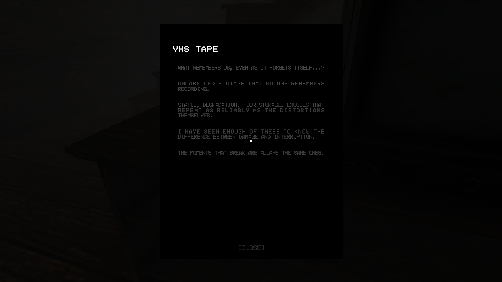

# BASEMENT1995
The project is a learning experience and active work in progress focused on environmental storytelling, interactive object systems, and UI-driven narrative delivery.

## Features
- First-Person Exploration – WASD movement with mouse look controls
- Interactive Object System – clickable items reveal lore through a document UI
- Custom UI Document Display – classic survival horror-inspired note system with custom backgrounds
- Opening – timed subtitles with fade effects establishing narrative context
- Environmental Storytelling – a remote basement hideout beneath an abandoned arcade during an apocalyptic timeline

## Technologies
- Unity 6.3 – game engine and scene management
- C# – game logic, player controller, interaction systems
- TextMeshPro – UI text rendering
- Canvas Groups – fade effects and UI state management

## Controls
- WASD – Move character
- Mouse – Look around
- Left Click – Interact with objects
- ESC – Unlock cursor

## How to Run
This project is currently a development build and does not have a distributed executable.

To run locally in Unity:
```bash
git clone https://github.com/mechagr/northernlights-BASEMENT1995.git
```
Open the project folder in Unity Hub

Press Play in the Unity Editor to run the prototype

## Current State
**Version 0.2**
- Single room environment
- Interactive objects with lore documents
- Short opening subtitle
- Atmospheric lighting 
- Functional first-person controller

## Screenshots












## Planned Features
- Sound effects (footsteps, computer beeps)
- Visual effects (flickering lights, screen distortion)
- Introduction of gameplay mechanics

## Assets & Credits
- **3D Models & Textures**: [PSX Mega Pack](https://pizzadoggy.itch.io/psx-mega-pack) by Pizza Doggy
- **Arcade Machine 3D Models & Textures**: [DS Arcade Machine](https://assetstore.unity.com/packages/3d/props/electronics/ds-arcade-machine-121654) by Dan Sanderson
- **Music**: [Music Pack From The 90's Volume 1](https://assetstore.unity.com/packages/audio/music/music-pack-from-the-90-s-volume-1-free-samples-245823) by Bertrand Guégan